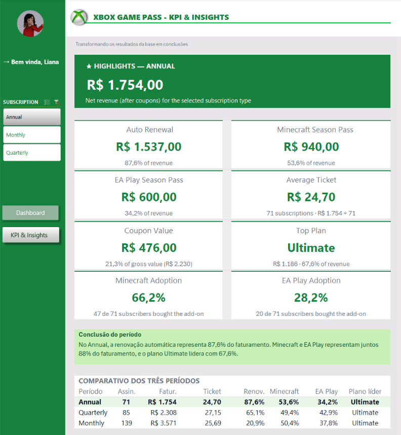

# Xbox Game Pass Subscription Sales

Dashboard desenvolvido em Excel para analisar vendas e assinaturas do Xbox Game Pass. A ideia foi transformar os dados da base em informações mais claras para análise de faturamento.

Durante o desenvolvimento, procurei não focar somente na parte visual. Também trabalhei na definição de perguntas de negócio, organização dos dados, criação dos cálculos e na forma como os resultados seriam apresentados no dashboard.

## Objetivo

A proposta do projeto foi analisar uma base de assinaturas do Xbox Game Pass e criar um dashboard capaz de responder perguntas de negócio a partir desses dados.

Durante a construção, procurei manter a análise objetiva, sem adicionar informações ou gráficos apenas para preencher espaço.

Também considerei alguns pontos importantes para a construção do dashboard:

- organização da base de dados;
- definição das perguntas de negócio;
- criação de tabelas dinâmicas;
- utilização de gráficos dinâmicos;
- segmentação dos dados;
- atualização das informações;
- padronização de cores e fontes;
- organização dos elementos;
- identificação do período analisado e da última atualização.

## Estrutura do projeto

O arquivo Excel foi organizado em cinco abas, cada uma com uma função:

- **Bases**: contém os dados das assinaturas, planos, datas, renovação automática, valores, Season Pass e cupons.
- **Assets**: reúne elementos utilizados na identidade visual, como cores, logos e ícones.
- **Cálculos**: contém as tabelas dinâmicas utilizadas para responder às perguntas de negócio e os cálculos utilizados no dashboard e na aba de indicadores.
- **Dashboard**: apresenta os principais resultados da análise, com indicadores, gráficos e segmentação de dados.
- **KPI & Insights**: reúne indicadores adicionais, comparação entre os tipos de assinatura e conclusões a partir dos resultados.

## Perguntas de negócio

Defini cinco perguntas principais para orientar a análise:

1. Qual é o faturamento total das assinaturas?
2. Qual é o faturamento das assinaturas por renovação automática?
3. Qual é o faturamento das assinaturas do EA Play Season Pass?
4. Qual é o faturamento das assinaturas do Minecraft Season Pass?
5. Qual é o faturamento por plano?

A quinta pergunta foi acrescentada durante a construção do projeto, quando percebi que a base também permitia comparar o faturamento entre os planos **Core**, **Standard** e **Ultimate**.

Dessa forma, foi possível aproveitar melhor as informações disponíveis na base sem adicionar uma análise que não tivesse relação com os dados.

## Processo de construção

O fluxo utilizado durante o desenvolvimento foi:

**Base de dados → Tabelas Dinâmicas → Gráficos Dinâmicos → Dashboard → KPI & Insights**

Primeiro analisei a base para entender quais informações poderiam gerar perguntas de negócio.

Depois, criei as tabelas dinâmicas na aba **Cálculos** e utilizei esses resultados para construir os gráficos e indicadores apresentados no projeto.

Também utilizei uma segmentação de dados para o tipo de assinatura, com as opções:

- **Annual**
- **Quarterly**
- **Monthly**

A segmentação está conectada às análises, permitindo alterar o tipo de assinatura e atualizar os resultados apresentados no Dashboard.

A partir dos resultados obtidos, também criei a aba **KPI & Insights**, com o objetivo de transformar os números em informações mais fáceis de interpretar.

## Organização visual

Para a identidade visual, utilizei principalmente tons de verde relacionados ao Xbox e mantive as cores organizadas na aba **Assets**.

Durante a construção, procurei manter um padrão visual entre os elementos e tomei alguns cuidados, como:

- utilizar títulos objetivos;
- manter as cores consistentes;
- alinhar os elementos;
- utilizar fontes de forma padronizada;
- evitar excesso de informações;
- deixar espaço suficiente para facilitar a leitura;
- informar o período analisado;
- informar a data da última atualização.

Também procurei escolher os gráficos de acordo com o tipo de análise.

No gráfico **Revenue by Auto Renewal**, mantive a mesma cor para as categorias **Yes** e **No**, por fazerem parte da mesma análise.

Já no gráfico **Revenue by Plan**, utilizei diferentes tons de verde para facilitar a diferenciação entre **Core**, **Standard** e **Ultimate**, sem sair da identidade visual do projeto.

## Dashboard

O Dashboard apresenta as principais análises de faturamento por meio de indicadores e gráficos:

- **Revenue by Auto Renewal** — análise do faturamento de acordo com a renovação automática das assinaturas.
- **Revenue by Plan** — comparação do faturamento entre os planos **Core**, **Standard** e **Ultimate**.
- **EA Play Season Pass Revenue** — faturamento relacionado ao EA Play Season Pass.
- **Minecraft Season Pass Revenue** — faturamento relacionado ao Minecraft Season Pass.
- **Average Ticket** — valor médio por assinatura.
- **Top Plan** — plano com maior faturamento no período selecionado.

Também apresenta o período analisado, a data da última atualização e a segmentação **SUBSCRIPTION**, que permite alternar entre **Annual**, **Quarterly** e **Monthly**.

## KPI & Insights

A aba **KPI & Insights** foi adicionada como uma etapa complementar da análise.

A ideia foi ir além da apresentação dos números e transformar os resultados em informações mais fáceis de interpretar.

Os principais indicadores apresentados são:

- **Auto Renewal**;
- **Minecraft Season Pass**;
- **EA Play Season Pass**;
- **Average Ticket**;
- **Coupon Value**;
- **Top Plan**;
- **Minecraft Adoption**;
- **EA Play Adoption**.

Os indicadores acompanham o tipo de assinatura selecionado na segmentação do Dashboard.

Também foi criado um **comparativo entre Annual, Quarterly e Monthly**, permitindo observar diferenças de:

- quantidade de assinaturas;
- faturamento;
- ticket médio;
- renovação automática;
- Minecraft;
- EA Play;
- plano líder.

Além disso, a aba possui uma **conclusão automática do período**, utilizando os resultados calculados para destacar os principais pontos da análise.

## Imagens do projeto

### Dashboard

*Visão geral do dashboard com os principais indicadores, gráficos e segmentação de dados.*

### KPI & Insights

*Aba criada para complementar o dashboard com indicadores, comparação entre períodos e conclusões da análise.*

### Cálculos

*Aba Cálculos com as tabelas dinâmicas e os cálculos utilizados para alimentar as análises.*

### Assets

*Organização das cores, logos e elementos utilizados na identidade visual do projeto.*

## Boas práticas aplicadas

Durante a construção do projeto, percebi que um dashboard não depende apenas da quantidade de gráficos ou de recursos utilizados.

Alguns cuidados fizeram diferença no resultado:

- definir as perguntas antes de criar os gráficos;
- separar a base, os cálculos e a apresentação;
- utilizar tabelas dinâmicas para facilitar a atualização;
- conectar a segmentação às análises;
- manter uma identidade visual consistente;
- informar o período dos dados e a data de atualização;
- evitar informações desnecessárias;
- pensar na facilidade de interpretação dos resultados.

Também procurei prestar atenção em pequenos detalhes de apresentação, como fontes, cores, alinhamento, espaçamento e organização do conteúdo.

A ideia foi encontrar um equilíbrio entre análise e visualização, deixando o dashboard simples, mas sem perder as informações importantes.

## Como reproduzir

Para visualizar e reproduzir o projeto:

1. Baixe o arquivo `.xlsx` disponível neste repositório.
2. Abra o arquivo no Microsoft Excel.
3. Acesse a aba **Bases** para visualizar os dados utilizados.
4. Consulte a aba **Cálculos** para visualizar as tabelas dinâmicas e os cálculos.
5. Acesse a aba **Dashboard** para visualizar as principais análises.
6. Utilize a segmentação **SUBSCRIPTION** para alternar entre **Annual**, **Quarterly** e **Monthly**.
7. Acesse a aba **KPI & Insights** para visualizar os indicadores, o comparativo dos períodos e as conclusões da análise.

## Resultado

O resultado final foi um dashboard organizado e focado nas principais informações de faturamento das assinaturas do Xbox Game Pass.

A inclusão da aba **KPI & Insights** permitiu complementar o dashboard com indicadores adicionais, comparação entre os diferentes tipos de assinatura e conclusões baseadas nos resultados.

Este projeto me ajudou a entender melhor que a construção de um dashboard vai além da parte visual. Antes de criar os gráficos, é importante entender a base, definir o que quero descobrir com os dados e organizar os cálculos para chegar aos resultados.

Também pude praticar o uso de tabelas dinâmicas, gráficos dinâmicos e segmentação de dados, além de trabalhar a organização visual e a apresentação das informações.

## Ferramentas utilizadas

- Microsoft Excel
- Tabelas Dinâmicas
- Gráficos Dinâmicos
- Segmentação de Dados
- Fórmulas e cálculos no Excel
- Organização e padronização visual

---

## Sobre o desenvolvimento

Projeto realizado como parte dos estudos na **DIO**, acompanhando a construção da planilha durante as aulas.

Acrescentei funcionalidades e melhorias ao longo do desenvolvimento para tornar a ferramenta mais completa e prática, incluindo novas perguntas de negócio, análises e a aba **KPI & Insights**.

**Desenvolvido por Letícia Alves**
