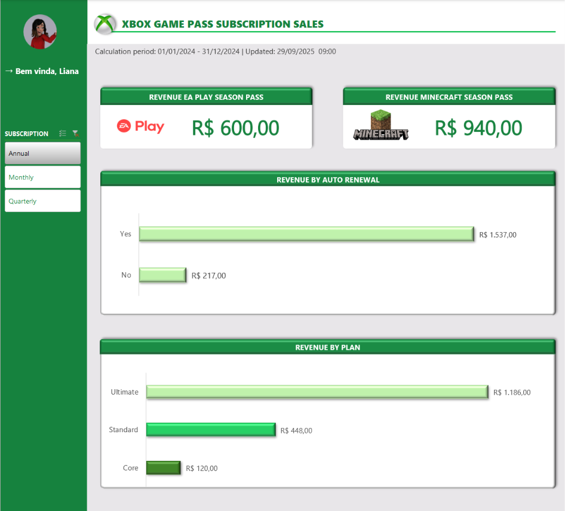
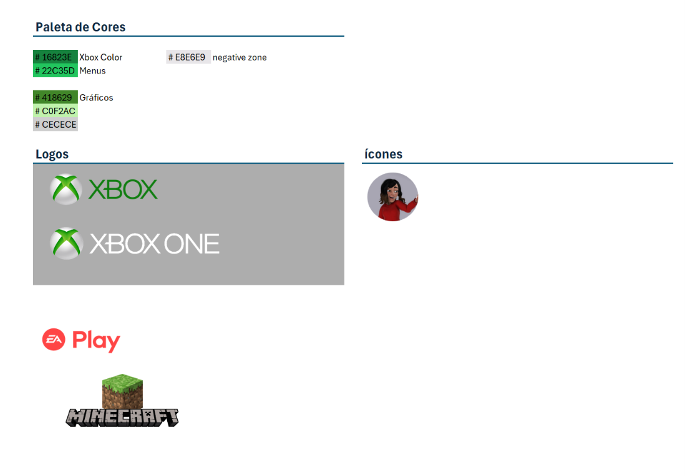
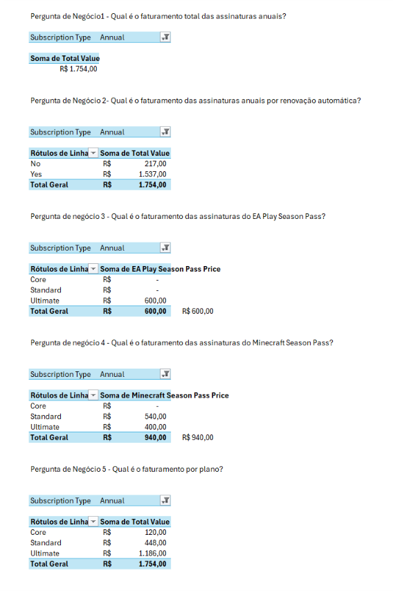

# Xbox Game Pass Subscription Sales

Dashboard desenvolvido em Excel para analisar vendas e assinaturas do Xbox Game Pass. A ideia foi transformar os dados da base em informações mais claras para análise de faturamento.

Durante o desenvolvimento, procurei não focar somente na parte visual. Também trabalhei na definição de perguntas de negócio, organização dos dados, criação dos cálculos e na forma como os resultados seriam apresentados no dashboard.

## Objetivo

A proposta do projeto foi analisar uma base de assinaturas do Xbox Game Pass e criar um dashboard capaz de responder perguntas de negócio a partir desses dados.

Durante a construção, procurei manter a análise objetiva, sem adicionar informações ou gráficos apenas para preencher espaço.

Também considerei alguns pontos importantes para a construção do dashboard:

- organização da base de dados;
- definição das perguntas de negócio;
- criação de tabelas dinâmicas;
- utilização de gráficos dinâmicos;
- segmentação dos dados;
- atualização das informações;
- padronização de cores e fontes;
- organização dos elementos;
- identificação do período analisado e da última atualização.

## Estrutura do projeto

O arquivo Excel foi organizado em quatro abas, cada uma com uma função:

- **Bases**: contém os dados das assinaturas, planos, datas, renovação automática, valores e Season Pass.
- **Assets**: reúne elementos utilizados na identidade visual, como cores, logos e ícones.
- **Cálculos**: contém as tabelas dinâmicas utilizadas para responder às perguntas de negócio.
- **Dashboard**: reúne os principais indicadores, gráficos e a segmentação de dados.

## Perguntas de negócio

Defini cinco perguntas principais para orientar a análise:

1. Qual é o faturamento total das assinaturas anuais?
2. Qual é o faturamento das assinaturas anuais, considerando a renovação automática?
3. Qual é o faturamento das assinaturas do EA Play Season Pass?
4. Qual é o faturamento das assinaturas do Minecraft Season Pass?
5. Qual é o faturamento por plano?

A quinta pergunta foi acrescentada durante a construção do projeto, quando percebi que a base também permitia comparar o faturamento entre os planos **Core**, **Standard** e **Ultimate**.

Dessa forma, a análise não ficou somente nas perguntas inicialmente definidas e foi possível aproveitar melhor as informações disponíveis na base.

## Processo de construção

O fluxo utilizado durante o desenvolvimento foi:

**Base de dados → Tabelas Dinâmicas → Gráficos Dinâmicos → Dashboard**

Primeiro analisei a base para entender quais informações poderiam gerar perguntas de negócio.

Depois, criei as tabelas dinâmicas na aba **Cálculos**, utilizando os resultados dessas tabelas para construir os gráficos e indicadores apresentados no dashboard.

Os gráficos foram mantidos conectados às tabelas dinâmicas, permitindo que as análises fossem atualizadas de acordo com os filtros utilizados.

Também utilizei uma segmentação de dados para o tipo de assinatura, com as opções:

- **Annual**
- **Monthly**
- **Quarterly**

A segmentação está conectada às análises, permitindo alterar o tipo de assinatura e atualizar os resultados apresentados no dashboard.

## Organização visual

Para a identidade visual, utilizei principalmente tons de verde relacionados ao Xbox e mantive as cores organizadas na aba **Assets**.

Durante a construção, procurei manter um padrão visual entre os elementos e tomei alguns cuidados, como:

- utilizar títulos objetivos;
- manter as cores consistentes;
- alinhar os elementos;
- utilizar fontes de forma padronizada;
- evitar excesso de informações;
- deixar espaço suficiente para facilitar a leitura;
- informar o período analisado;
- informar a data da última atualização.

Também procurei escolher os gráficos de acordo com o tipo de análise.

No gráfico **Revenue by Auto Renewal**, mantive a mesma cor para as categorias **Yes** e **No**, por fazerem parte da mesma análise.

Já no gráfico **Revenue by Plan**, utilizei diferentes tons de verde para facilitar a diferenciação entre **Core**, **Standard** e **Ultimate**, sem sair da identidade visual do projeto.

## Dashboard

O dashboard apresenta as principais análises de faturamento por meio de indicadores e gráficos:

- **Revenue by Auto Renewal** — análise do faturamento de acordo com a renovação automática das assinaturas.
- **Revenue by Plan** — comparação do faturamento entre os planos **Core**, **Standard** e **Ultimate**.
- **Revenue EA Play Season Pass** — indicador de faturamento relacionado ao EA Play Season Pass.
- **Revenue Minecraft Season Pass** — indicador de faturamento relacionado ao Minecraft Season Pass.

Também apresenta o período analisado, a data da última atualização e a segmentação **SUBSCRIPTION**, que permite alternar entre os tipos de assinatura.

## Imagens do projeto

### ### Dashboard/ Visão geral

*Visão geral do dashboard com os principais indicadores, gráficos e segmentação de dados.*

### Assets

*Organização da identidade visual utilizada no projeto.*

### Cálculos

*Aba Cálculos com as tabelas dinâmicas utilizadas para responder às perguntas de negócio e alimentar os gráficos do dashboard.*

## Boas práticas aplicadas

Durante a construção do projeto, percebi que um dashboard não depende apenas da quantidade de gráficos ou de recursos utilizados.

Alguns cuidados fizeram diferença no resultado:

- definir as perguntas antes de criar os gráficos;
- separar a base, os cálculos e a apresentação;
- utilizar tabelas dinâmicas para facilitar a atualização;
- conectar a segmentação às análises;
- manter uma identidade visual consistente;
- informar o período dos dados e a data de atualização;
- evitar informações desnecessárias;
- pensar na facilidade de interpretação dos resultados.

Também procurei prestar atenção em pequenos detalhes de apresentação, como fontes, cores, alinhamento, espaçamento e organização do conteúdo.

A ideia foi encontrar um equilíbrio entre análise e visualização, deixando o dashboard simples, mas sem perder as informações importantes.

## Como reproduzir

Para visualizar e reproduzir o projeto:

1. Baixe o arquivo `.xlsx` disponível neste repositório.
2. Abra o arquivo no Microsoft Excel.
3. Acesse a aba **Bases** para visualizar os dados utilizados.
4. Consulte a aba **Cálculos** para visualizar as tabelas dinâmicas.
5. Acesse a aba **Dashboard** para visualizar as análises.
6. Utilize a segmentação **SUBSCRIPTION** para alternar entre **Annual**, **Monthly** e **Quarterly**.

## Resultado

O resultado final foi um dashboard simples e organizado, com foco nas principais informações de faturamento das assinaturas do Xbox Game Pass.

Este projeto me ajudou a entender melhor que a construção de um dashboard vai além da parte visual. Antes de criar os gráficos, é importante entender a base, definir o que quero descobrir com os dados e organizar os cálculos para chegar aos resultados.

Também pude praticar o uso de tabelas dinâmicas, gráficos dinâmicos e segmentação de dados, além de trabalhar a organização visual e a apresentação das informações.

## Ferramentas utilizadas

- Microsoft Excel
- Tabelas Dinâmicas
- Gráficos Dinâmicos
- Segmentação de Dados
- Fórmulas e cálculos no Excel
- Organização e padronização visual

 ---

## Sobre o desenvolvimento

Projeto realizado como parte dos estudos na **DIO**, acompanhando a construção da planilha durante as aulas.  
Acrescentei funcionalidades e melhorias para tornar a ferramenta mais completa e prática.  

**Desenvolvido por Letícia Alves**

